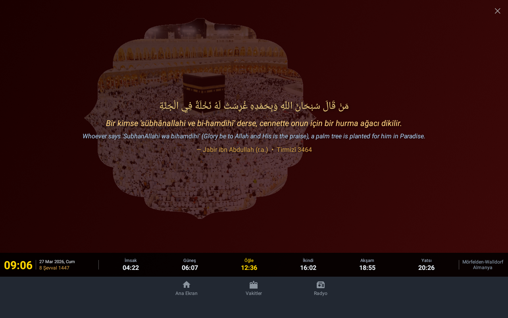
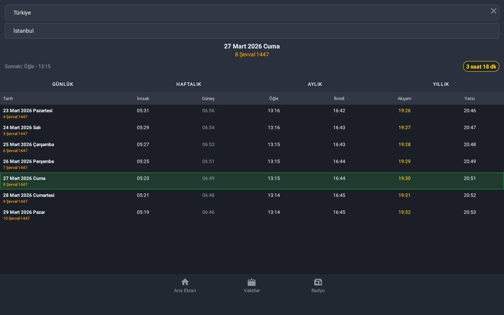
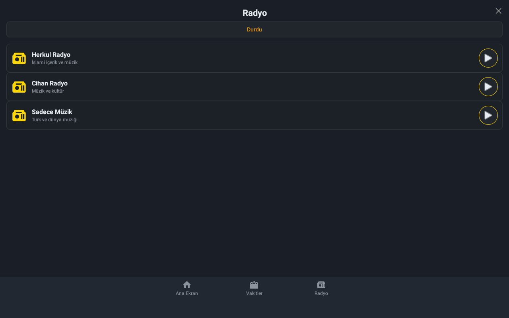

# Herkul — Namaz Vakitleri & Radyo


Diyanet İşleri Başkanlığı'nın resmi sitesinden namaz vakitlerini çeken, Herkul radyo istasyonunu yayınlayan Android uygulaması. **Ayine.tv** cihazları için özel olarak tasarlanmıştır.







---

## Özellikler

### Namaz Vakitleri
- Türkiye'nin **81 ili** için Diyanet'ten canlı veri çekme
- Günlük ve aylık görünüm
- Sonraki namaza geri sayım sayacı
- **Hicri + Miladi** tarih gösterimi
- Anlık saat

### Radyo
| İstasyon |
|---|
| Herkul Radyo |
| Cihan Radyo |
| Sadece Müzik |

### Arayüz
- Tam ekran (immersive) mod — status bar ve navigation bar gizlenir
- Ekran her zaman açık kalır (ekran koruyucuya düşmez)
- Kuran ayetleri, hadisler ve İslami sözler rotasyonu
- Koyu tema

---

## Gereksinimler

| Özellik | Değer |
|---|---|
| Minimum Android | 6.0 Marshmallow (API 23) |
| Hedef Android | 11 (API 30) |
| Mimari | armeabi-v7a |
| İnternet | Gerekli (Diyanet + radyo akışı) |

---

## Kurulum

### APK ile (Ayine cihazı)

```bash
adb install -r app-debug.apk
```

### Kaynak koddan derle

```bash
git clone https://github.com/faymaz/herkul.git
cd herkul
./gradlew assembleDebug
adb install -r app/build/outputs/apk/debug/app-debug.apk
```


## İlham Kaynağı

Bu uygulama, GNOME masaüstü için geliştirilmiş [herkul](https://github.com/faymaz/herkul) GNOME Shell eklentisinden ilham alınarak Android'e taşınmıştır.

---

## Ayine.tv

Bu uygulama, **Ayine.tv** Android cihazları için optimize edilmiştir.

[](https://www.ayine.tv)

> [www.ayine.tv](https://www.ayine.tv) — Ayine Dijital Çerçeve Ezan Saati

Ayine Dijital Çerçeve namaz vakitlerinde özel seçilmiş ezanlarla ve ilham verici tefekkür levhalarıyla mekanınızı farklılaştıran bir cihazdır.
